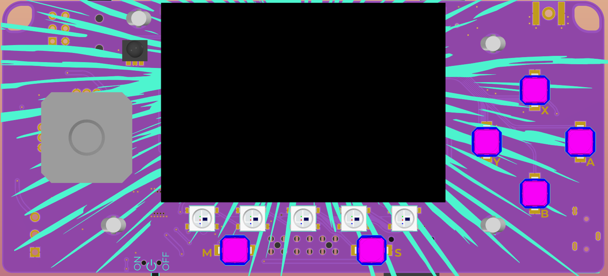
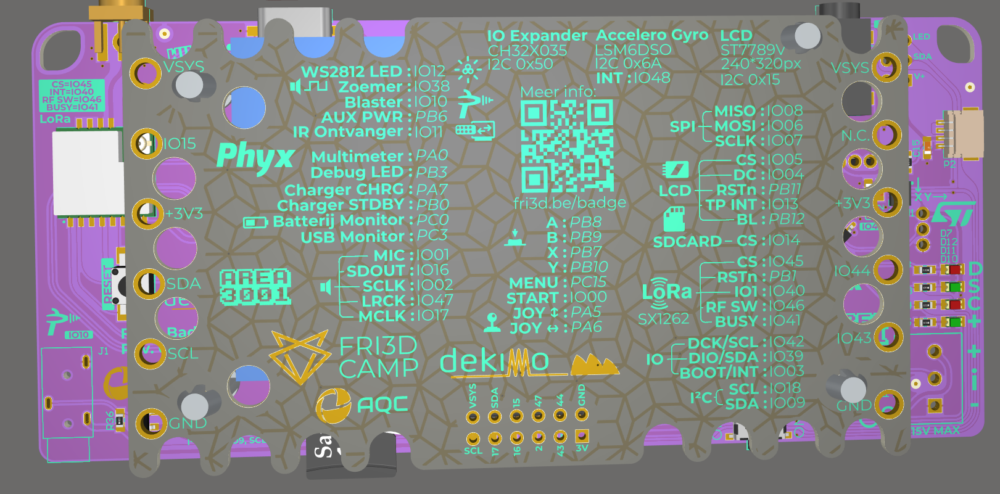
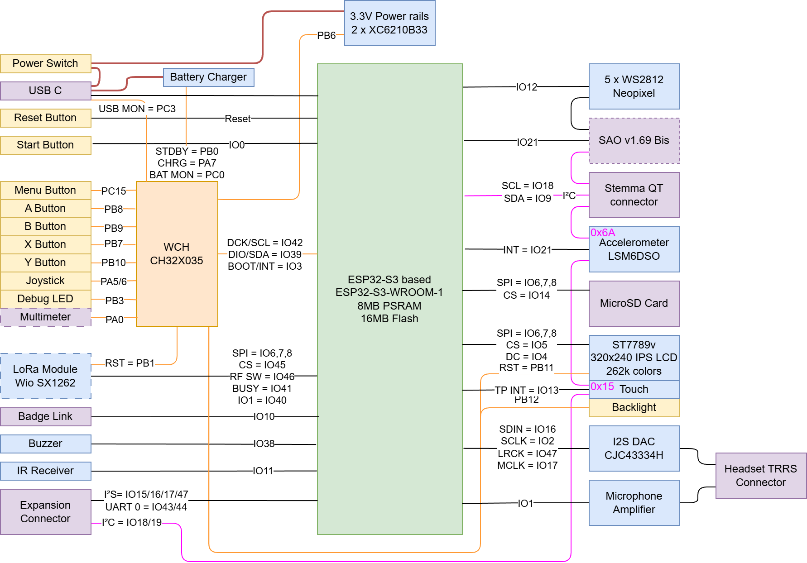

# Badge 2026 hardware
In deze Git repository kan je de ontwerpbestanden en productiedata vinden van de [Fri3d Camp](https://fri3d.be/) 2026 badge. Revisie 02 is de versie die op kamp zal uitgedeeld worden.

Het schema kan je terug vinden in de [revisie 02 map](<Fri3d_2026_Badge_02/OUTPUT/Fri3D Badge 2026_02.PDF>).

De badge is gebouwd rond de **Espressif [ESP32-S3-WROOM-1-N16R8](Datasheets/esp32-s3-wroom-1_wroom-1u_datasheet_en.pdf) module** met :

- 16MB flash 
- 8MB PSRAM. 
- De [ESP32-S3](Datasheets/esp32-s3_datasheet_en.pdf) dual-core Xtensa LX7 microcontroller (geklokt aan 240MHz)
- Wi-Fi (via de ESP32-S3)
- Bluetooth 5 (via de ESP32-S3)

Omdat deze microcontroller zelf een USB interface heeft is er geen nood meer om een USB serial brug te voorzien zoals op de [badge van 2022]( https://github.com/Fri3dCamp/badge-2020) en de [badge van 2018]( https://github.com/Fri3dCamp/badge). 

We hebben de badge ook uitgerust met:

- [6-assige IMU van ST](Datasheets/lsm6dso.pdf) met dank aan [EBV](https://my.avnet.com/ebv/)
- buzzer
- veel drukknoppen
- joystick
- microSD kaart lezer
- prachtige [2” IPS LCD met touchscreen](Datasheets/HXR20062C21.pdf)
- audio in- en uitgang in de vorm van een 3.5mm TRRS jack
- [extra microcontroller](Datasheets/CH32X035DS0.PDF) voor meer IO
- optionele [LoRa module](https://www.seeedstudio.com/Wio-SX1262-Wireless-Module-without-IPEX-Tape-Reel-p-6417.html)

Er is opnieuw een [tweede voeding](Datasheets/xc6210.pdf) geplaatst om de Wi-Fi module afzonderlijk van voeding te voorzien. Om energie te besparen kan je deze uitschakelen, enkel de ESP32-S3 en de board controller zullen dan nog stroom krijgen. 

Om het geheel van stroom te voorzien gebruiken we deze keer een [2000mAh lithium polymeer cel](Datasheets/2000mAh_704060_battery_Tewaycell.pdf) met een ingebouwd beschermingscircuit. Deze batterijen zijn mechanisch niet zo sterk als de 18650 cellen die we in vorige editie gebruikten, daarom heeft de badge standaard een cover om de batterij te beschermen. 

Om de batterij op te laden via de ingebouwde USB-C poort, maken we opnieuw gebruik van de [TP4056 lineaire lader](Datasheets/TP4056.pdf). 

Er is ook een aansluiting voor de [blaster van 2024]( https://github.com/Fri3dCamp/blaster_2024) ([die van 2022]( https://github.com/Fri3dCamp/timeblaster-2020) is ook compatibel met deze badge!). 

We hebben plek voorzien voor een [SAO header]( https://hackaday.com/2019/03/20/introducing-the-shitty-add-on-v1-69bis-standard/) en is er onderaan een eigen uitbreidingsconnector waar je makkelijk een draadje in kan steken om te experimenteren.

Voor de liefhebbers heeft Yvan Barbaix ook een 3D model gemaakt om de joystick wat gebruiksvriendelijker te maken. Deze kan je terugvinden in de `Mechanical` map. Verder kan je het 3D model van de badge en cover ook terugvinden in [deze map](Mechanical/).

Het blokschema van de badge geeft tevens een mooi overzicht hoe alles verbonden is met elkaar, dit is een vereenvoudigde weergave van [het schema](<Fri3d_2026_Badge_02/OUTPUT/Fri3D Badge 2026_02.PDF>).

# Badge 2026 hardware (EN)
This repository contains the hardware design and production files for the [Fri3d Camp](https://fri3d.be/en/) 2024 badge.
Revision 02 will be handed out during the event.

